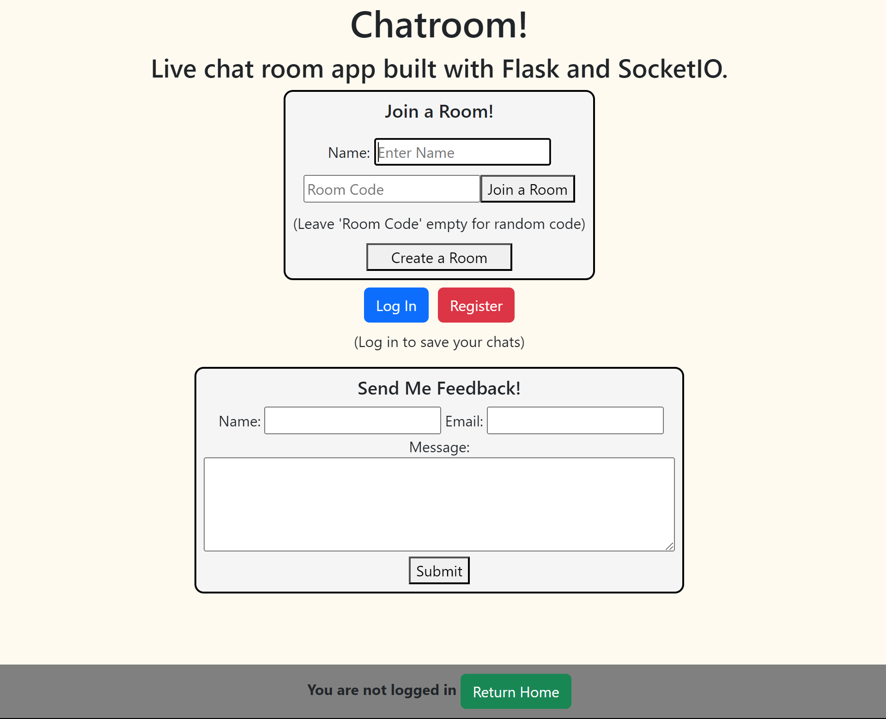
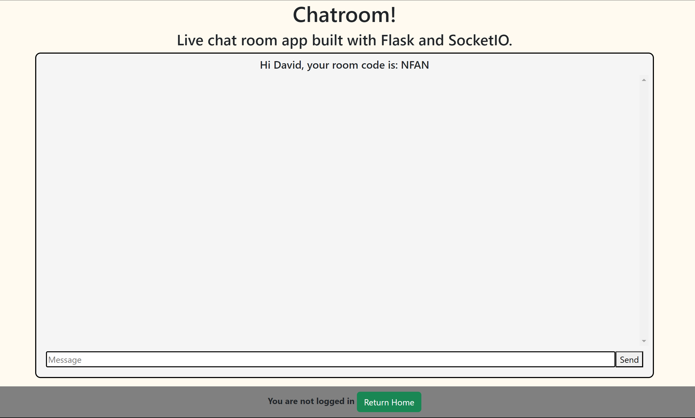
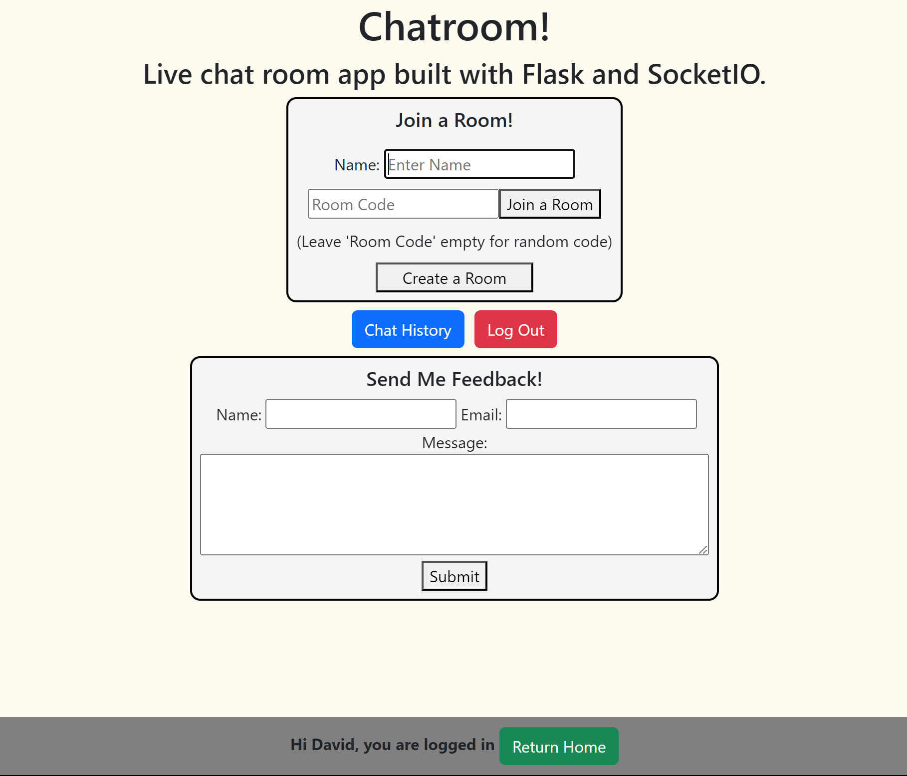
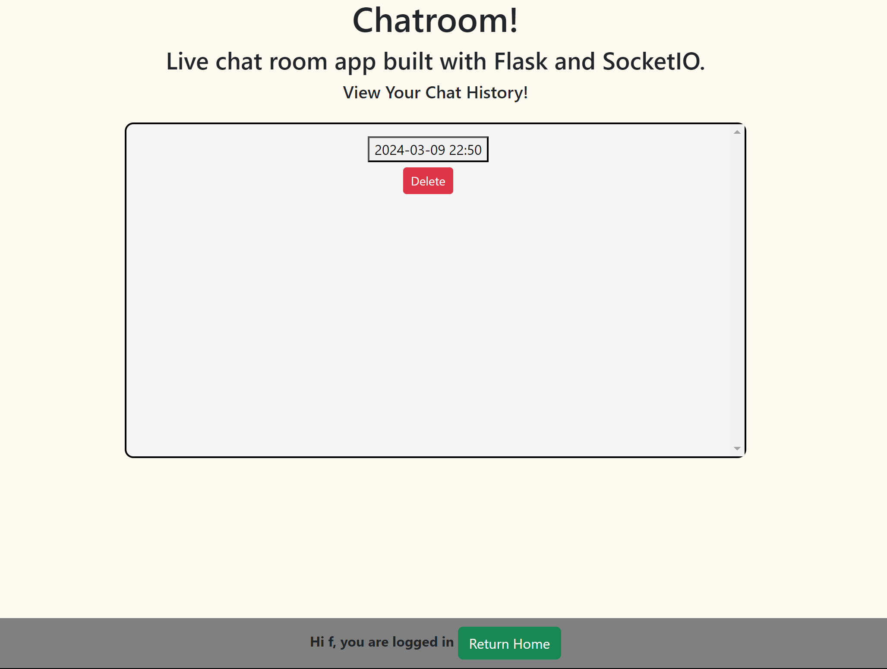
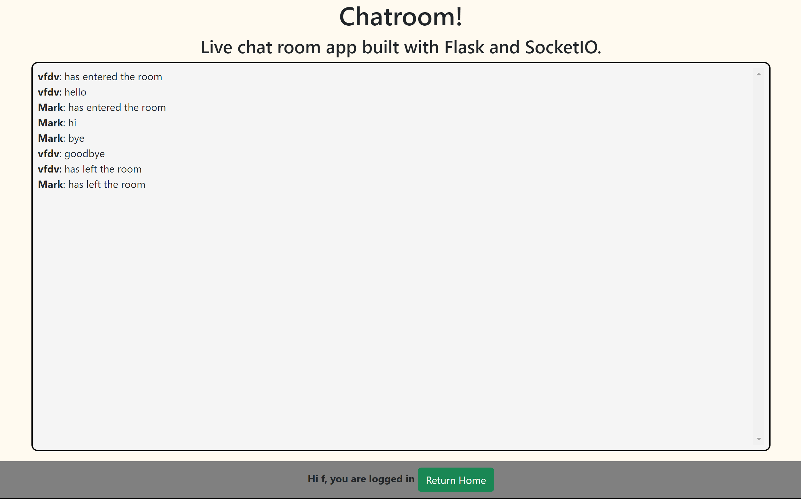

# Flask Chatroom
#### Video Demo:  <URL HERE>
> My final project for CS50, Harvard's introduction to Computer Science.

#### Overview
This project is a chatroom web app I developed with the Flask framework and Websockets (flask_socketio library).

#### Libraries Used
- flask - This library contains the framework with which I developed my app.

- flask_mail - I used flask_mail to implement the feedback form on the homepage of my app. It allows users to send an email to me with any input about my page.
- flask_socketio - SocketIO was the tool I used to facilitate the message sending feature of my app.
- random - I used the random library for generating random room codes.
- re - From re, I used the findall function in the chat history page.
```python
idTimeList = []
# Getting date of creation for all chats
for id in id_list:
    cur.execute("SELECT DISTINCT time FROM chatlogs WHERE chat_id = ? LIMIT 1", (id,))
    time = cur.fetchall()[0][0]
    # Extract date and time excluding seconds
    pattern = r'\b\d{4}-\d{2}-\d{2} \d{2}:\d{2}\b'  
    date = findall(pattern, time)[0]
    idTimeList.append({"chat_id": id, "time": date})
```

This code snippet is from the '/chatlogs' app route. When displaying chat history, the chats are all displayed with the date and time of creation of the room itself. Therefore, I looped through all the chats in the user's chat history and extracted their date and time information excluding seconds by searching based on the regular expression variable 'pattern'.

- datetime - The datetime library was used for obtaining the time at which a chatroom was made.

- sqlite3 - Used for storing user account information (username, hashed passwords, chatlogs, access permits to chatlogs).
- string - I imported ascii_uppercase from string for generating random room codes.
- werkzeug.security - This library allowed me to hash users' passwords for secure storage in my database.
- os, dotenv - These libraries allowed me to use enviornment variables, allowing me to securely stores the variables for my email and password that were utilised for the feedback form. This was cruical as while I could've just put these variables straight into app.py, it wouldn't have been secure and pushing personal information to a public GitHub repo would've been very risky.

| Homepage |
| :---: |
| 

#### How It Works
This app allows you to send text messages to other people in a chatroom. To create a room, you must enter a name and, optionally, a room code. If you don't enter a room code and create, a random 4-character ASCII code will be generated.

In order to join a room, you must again enter a name and the room code corresponding to the room you want to join. Then you can click join and you will enter the chatroom.

| Chatroom |
| :---: |
| 

Optionally, you may also choose to create an account via 'register'. Doing so will allow you to access the chatlogs of any rooms you have joined while you were logged in.

| Homepage When Logged In |
| :---: |
|  |

These chats, as well as the accounts of all registered users, are all stored in a sqlite database, which is manipulated in the back-end through the sqlite3 library.

```python
conn = sqlite3.connect('logs.db')
cur = conn.cursor()
cur.execute("INSERT INTO chatlogs (chat_id, name, message, time) VALUES (?, ?, ?, ?)", (rooms[room]["chat_id"], name, data["data"], datetime.now()))
conn.commit()
conn.close()
```

- This is a short code snippet from app.py, the python-based back-end script which has all the routes for my application. Here, this is the code my app utilises to add messages to the 'chatlogs' table of my database.

| Chat History Page | Viewing Chatlog |
| :---: | :--: |
|  |  |

#### Sending Messages With Websockets

The main part of this application is the chatroom feature. It uses websockets to relay information (text messages) to other people. 

```python
@app.route("/room")
def room():
    room = session.get("room")
    username = session.get("username")

    # Ensures user cannot access room page without first going through home page
    if room is None or session.get("name") is None or room not in rooms:
        return redirect(url_for("home"))
    
    return render_template("room.html", code=room, name=session["name"], messages=rooms[room]["messages"], logusername=username)
```

When a user joins or creates a room, the route /room is run, which validates that the user has accessed this path from the home page (the user has actually passed validation for creating or joining a room). If this is not the case, they are redirected back to the home page. Otherwise, the room.html template is rendered, and the room code, display name, account username and messages are passed through as variables.

```HTML



    Room



    <div class="message-box">
        <h5>Hi {{ name }}, your room code is: {{ code }}</h5>
        <div class="messages" id="messages"></div>
        <form>
            <div class="input">
                <input autofocus type="text" rows="3" placeholder="Message" name="message" id="message"/>
                <!-- Justification for 'return false': This prevents ususl form behaviour of refreshing page when a form is submitted.
                Returning false stops the submission process from completing, therefore preventing the page from refreshing. -->
                <button type="submit" name="send" id="send-btn" onClick="sendMessage(); return false;">Send</button>
            </div>
        </form>
    </div>
```

The room.html layout consist of a layout (layout.html) template that is applied to all pages in my web app. It contains the name of the app as well as the footer, which informs the user if they are logged in and contains a button that allows them to return home.

When a user connects to a room, through Jinja, their name will be printed, as well as the room code that was either randomly generated with the random library or inputted by the user. A message box is displayed, which contains all messages that have been sent, as well as a form for sending messages. When this form is submitted, a JavaScript function sendMessage() is ran:

```javascript
<script>
    var socketio = io();
    
    // Get message content from input field
    const messages = document.getElementById("messages");

    // Creates message HTML content to insert into div with "messages" id
    const createMessage = (name, msg) => {
        const content = `
        <div class="text">
            <span>
                <strong>${name}</strong>: ${msg}    
            </span>
        </div>
        `;
        messages.innerHTML += content;
    };

    // Function that only runs when "message" event is detected from the server
    socketio.on("message", (data) => {
        createMessage(data.name, data.message);
    });

    // Runs when message is sent (send button is clicked)
    const sendMessage = () => {
        const message = document.getElementById("message");

        // Does nothing if no message was inputted
        if (message.value == "") return;

        // Emits message and clears it
        socketio.emit("message", { data: message.value });
        message.value = "";
    };
</script>
```

This function first gets the message content through accessing the input element by its id ("message"). If a message was inputted in the form, the message is emitted as a JSON through socketIO.

After that, the message is formatted into a HTML element, which is the inserted into the message box. At the point, the sending process has been completed, and the message should be visible to all users in the chatroom.

```javascript

    <script>
        createMessage("{{ msg.name }}", "{{ msg.message }}");
    </script>

```

In order to ensure that the messages don't disappear if the page was refreshed, a small JavaScript element has been used, which gets all messages in the message box and constantly creates them so they don't disappear upon refreshing.

>February 7, 2024:
I will be developing a Flask chat application that will allow you to talk with people over the internet.

>March 3, 2024:
This application was developed for CS50X, Harvard's online introduction to computer science course. 
Please note that this application uses environment variables for the feedback sending aspect, so if
you would like to utilise that feature, you will have to make a .env file in the directory and add
your email and app password.
